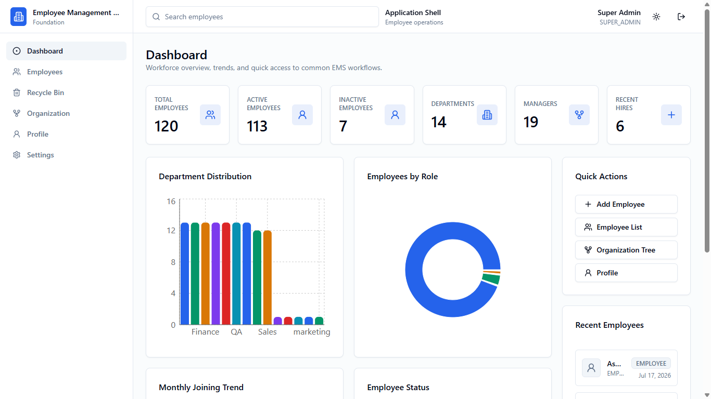
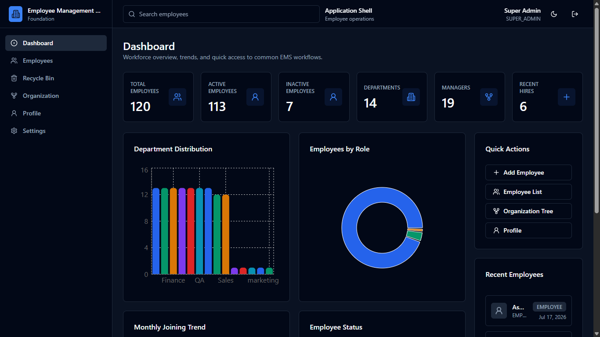
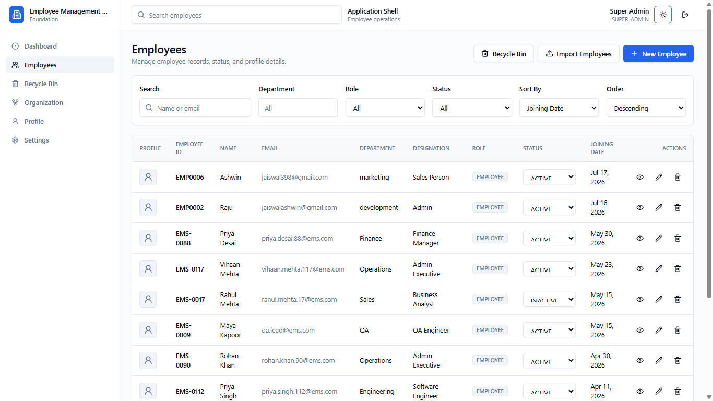
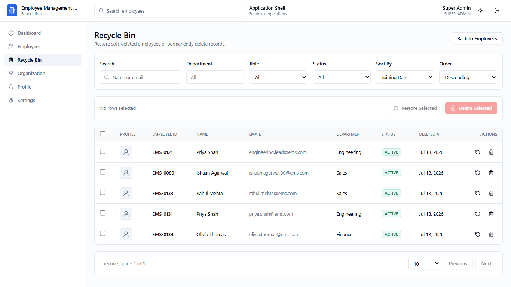
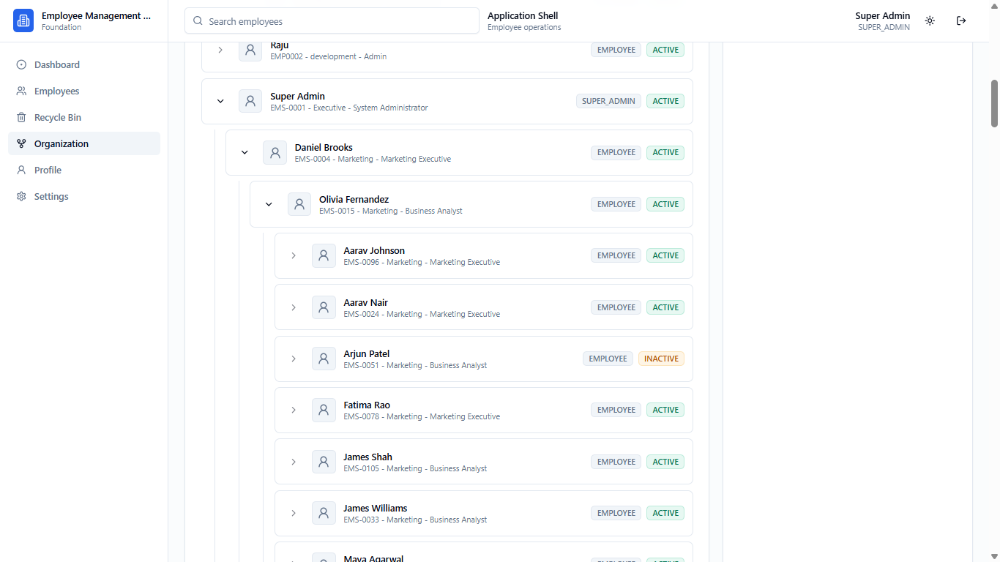
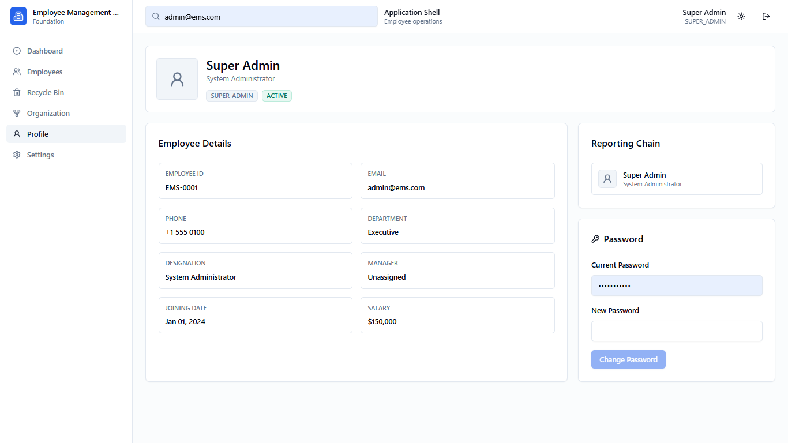
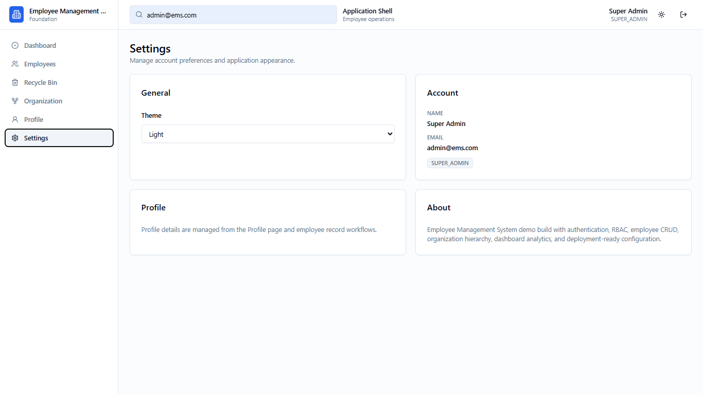

# Employee Management System

A production-ready full-stack Employee Management System built for a Full Stack Developer hiring assignment. The project is implemented as a TypeScript npm workspace with a Next.js frontend, Express API, MongoDB persistence, JWT authentication, role based access control, employee lifecycle workflows, hierarchy visualization, analytics, CSV import, and deployment-ready configuration.

## Live Demo

Frontend URL: Not committed in the repository metadata.

Local frontend: `http://localhost:4000`

Local backend health check: `http://localhost:5001/health`

The repository includes deployment configuration for Vercel frontend hosting and Render backend hosting. Add the deployed frontend URL here after retrieving it from the hosting dashboard.

## Overview

The Employee Management System centralizes employee records, workforce analytics, organization hierarchy, profile access, and administrative operations. The backend exposes a protected REST API with validation, RBAC checks, Mongoose models, soft-delete workflows, and CSV import validation. The frontend provides a role-aware application shell with dashboard charts, employee management screens, recycle-bin recovery, organization tree browsing, profile details, and theme preferences.

The implementation was audited directly from the codebase before documenting:

- Backend routes in `backend/src/routes`
- Controllers, services, repositories, validators, models, and middleware in `backend/src`
- Frontend routes, feature components, services, hooks, providers, and constants in `frontend/src`
- Deployment files `vercel.json` and `render.yaml`
- Environment examples in `frontend/.env.example` and `backend/.env.example`

## Features

- Authentication: Email and password login with JWT session tokens.
- Role Based Access Control: `SUPER_ADMIN`, `HR`, and `EMPLOYEE` roles with permission-based backend middleware and frontend route gates.
- Dashboard Analytics: Workforce cards, department distribution, employees by role, monthly joining trend, employee status, recent employees, and quick actions.
- Employee CRUD: Create, view, edit, status update, role update, manager assignment, profile image upload, and soft delete.
- Search: Employee list search and global employee search for privileged roles.
- Filtering: Department, role, and status filters on employee and recycle-bin lists.
- Sorting: Sort by joining date or employee name in ascending or descending order.
- Pagination: Page size selection and next/previous pagination for active and deleted employee lists.
- Soft Delete: Deleted employees are hidden from active lists and retained with deletion metadata.
- Restore: Single and bulk restore for soft-deleted employees.
- Permanent Delete: Single and bulk permanent deletion from the recycle bin.
- CSV Import: Template download, validation preview, duplicate detection, manager validation, circular reporting checks, and valid-row import.
- Organization Hierarchy: Recursive reporting tree, employee chain, direct reports, nested reportees, and manager candidates.
- Profile Management: Authenticated users can view their profile and reporting chain; profile update API supports phone/profile image changes.
- Settings: Account summary and theme preference controls.
- Responsive Design: Mobile sidebar, mobile employee cards, responsive charts, adaptive forms, and scrollable tables.
- Dark Mode: Light, dark, and system theme support through `next-themes`.
- Charts: Recharts bar, pie, and line charts.
- Deployment: Vercel frontend configuration, Render backend blueprint, MongoDB Atlas-ready environment variables, and production CORS support.

## Assignment Requirements Checklist

| Requirement               | Status      | Implementation Evidence                                                                                                              |
| ------------------------- | ----------- | ------------------------------------------------------------------------------------------------------------------------------------ |
| Authentication            | Implemented | `backend/src/routes/auth.routes.ts`, `backend/src/services/auth.service.ts`, `frontend/src/providers/auth-provider.tsx`              |
| Role Based Access Control | Implemented | `backend/src/constants/permissions.ts`, `backend/src/middlewares/auth.middleware.ts`, `frontend/src/components/layout/role-gate.tsx` |
| Dashboard                 | Implemented | `backend/src/routes/dashboard.routes.ts`, `frontend/src/features/dashboard/components/dashboard-page.tsx`                            |
| Employee CRUD             | Implemented | `backend/src/routes/employee.routes.ts`, `frontend/src/features/employees/components`                                                |
| Search                    | Implemented | `backend/src/repositories/employee.repository.ts`, `backend/src/routes/search.routes.ts`, `frontend/src/features/search`             |
| Filtering                 | Implemented | `employeeListQuerySchema`, employee list and recycle-bin components                                                                  |
| Sorting                   | Implemented | `EMPLOYEE_SORT_FIELDS`, list repository sorting                                                                                      |
| Pagination                | Implemented | `EmployeeListResult`, list and recycle-bin pagination controls                                                                       |
| Soft Delete               | Implemented | `softDeleteEmployeeById`, recycle-bin UI                                                                                             |
| Restore                   | Implemented | single and bulk restore endpoints and UI                                                                                             |
| Permanent Delete          | Implemented | single and bulk hard-delete endpoints and UI                                                                                         |
| CSV Import                | Implemented | `backend/src/services/employee-import.service.ts`, `EmployeeImportDialog`                                                            |
| Organization Hierarchy    | Implemented | `getOrganizationTree`, reportees, direct reports, chain, manager candidates                                                          |
| Profile Management        | Implemented | `/api/employees/me`, profile page, reporting chain                                                                                   |
| Settings                  | Implemented | settings page with theme and account summary                                                                                         |
| Responsive Design         | Implemented | mobile sidebar, card layouts, responsive grids, table overflow                                                                       |
| Dark Mode                 | Implemented | `next-themes`, `ThemeToggle`, settings theme selector                                                                                |
| Charts                    | Implemented | Recharts dashboard chart component                                                                                                   |
| Deployment                | Implemented | `vercel.json`, `render.yaml`, env examples                                                                                           |

## Tech Stack

| Area           | Technology                                                                                 |
| -------------- | ------------------------------------------------------------------------------------------ |
| Frontend       | Next.js 15, React 19, TypeScript, Tailwind CSS, shadcn-style UI primitives, Lucide React   |
| Backend        | Node.js, Express 4, TypeScript, Mongoose                                                   |
| Database       | MongoDB, MongoDB Atlas-ready connection configuration                                      |
| Authentication | JWT, bcrypt password hashing, localStorage token persistence on the client                 |
| Authorization  | Permission map plus Express `authenticate` and `authorize` middleware                      |
| Deployment     | Vercel for frontend, Render for backend, MongoDB Atlas for database                        |
| Charts         | Recharts                                                                                   |
| CSV            | Multer memory upload, custom CSV parser, canonical CSV header contract, Node test coverage |
| Validation     | Zod on backend request bodies/query/params and frontend forms                              |
| Data Fetching  | Axios and TanStack React Query                                                             |
| Tooling        | npm workspaces, ESLint, Prettier, TypeScript                                               |

## Folder Structure

Generated from the current repository structure, excluding `node_modules`, `.git`, and local logs.

```text
employee-management-system/
  backend/
    src/
      config/
      constants/
      controllers/
      middlewares/
      models/
      repositories/
      routes/
      seed/
      services/
      types/
      utils/
      validators/
      app.ts
      server.ts
    tests/
      employee-csv-contract.test.cjs
    .env.example
    nodemon.json
    package.json
    tsconfig.json
  docs/
    API.md
    ARCHITECTURE.md
    ASSIGNMENT-CHECKLIST.md
    CHANGELOG.md
    CONTRIBUTING.md
    DATABASE.md
    DEPLOYMENT.md
    FEATURES.md
    SCREENSHOTS.md
    SECURITY.md
    TESTING.md
  frontend/
    src/
      app/
        (protected)/
        (public)/
        globals.css
        layout.tsx
      components/
      constants/
      features/
      hooks/
      lib/
      providers/
      services/
      types/
      utils/
    .env.example
    components.json
    next.config.ts
    package.json
    tailwind.config.js
    tsconfig.json
  screenshots/
    dashboard-dark.png
    dashboard-light.png
    dashboard-light-scrolled.png
    employees-list.png
    organization-tree-hr.png
    organization-tree-management.png
    profile.png
    recycle-bin.png
    settings.png
  package.json
  render.yaml
  vercel.json
```

## Installation

### Prerequisites

- Node.js 20 or newer recommended for the Next.js 15 and TypeScript toolchain.
- npm 10 or newer.
- MongoDB Atlas cluster or local MongoDB instance.

### Backend Setup

```bash
cd backend
npm install
cp .env.example .env
```

Backend environment variables:

```env
PORT=5001
MONGODB_URI=mongodb+srv://<username>:<password>@<cluster-host>/employee_management
JWT_SECRET=replace-with-a-secure-secret
NODE_ENV=development
CORS_ORIGIN=http://localhost:4000
```

Start the backend:

```bash
npm run dev
```

The API runs on `http://localhost:5001`.

### Frontend Setup

```bash
cd frontend
npm install
cp .env.example .env
```

Frontend environment variables:

```env
NEXT_PUBLIC_API_URL=http://localhost:5001
```

Start the frontend:

```bash
npm run dev
```

The frontend runs on `http://localhost:4000`.

### Monorepo Setup

From the repository root:

```bash
npm install
npm run dev
```

The root `dev` script starts both frontend and backend with `concurrently`.

### Seed Data

The backend includes seed users and 120 realistic employee profiles.

```bash
npm run seed
```

Default credentials:

| Role        | Email              | Password      |
| ----------- | ------------------ | ------------- |
| Super Admin | `admin@ems.com`    | `Password123` |
| HR          | `hr@ems.com`       | `Password123` |
| Employee    | `employee@ems.com` | `Password123` |

Additional seed commands:

```bash
npm run seed:append
npm run db:seed
npm run db:seed:append
```

### Production Build

```bash
npm run build
```

Workspace-specific builds:

```bash
npm run build --workspace frontend
npm run build --workspace backend
```

Start the compiled backend:

```bash
npm run start --workspace backend
```

## API Documentation

Complete API documentation is available in [docs/API.md](docs/API.md).

Additional documentation:

- [Architecture](docs/ARCHITECTURE.md)
- [Database](docs/DATABASE.md)
- [Features](docs/FEATURES.md)
- [Deployment](docs/DEPLOYMENT.md)
- [Security](docs/SECURITY.md)
- [Testing](docs/TESTING.md)
- [Assignment Checklist](docs/ASSIGNMENT-CHECKLIST.md)
- [Screenshots](docs/SCREENSHOTS.md)
- [Changelog](docs/CHANGELOG.md)
- [Contributing](docs/CONTRIBUTING.md)

## Screenshots

### Dashboard Light



### Dashboard Dark



### Employee List



### Recycle Bin



### Organization Tree



### Profile



### Settings



See [docs/SCREENSHOTS.md](docs/SCREENSHOTS.md) for the complete screenshot catalog.

## Future Improvements

- Add a committed production frontend URL after deployment ownership is confirmed.
- Add automated integration tests for auth, RBAC, employee CRUD, soft delete, and CSV import.
- Add end-to-end browser tests for critical workflows.
- Add audit logging for create, update, delete, restore, import, role changes, and manager changes.
- Add password reset and password change API support.
- Move profile images to cloud object storage such as S3 or Cloudinary.
- Add dashboard export and report download options.
- Add invite-based onboarding and email notifications.
- Add CI workflow for lint, test, and build.

## License

No standalone license file is present in this repository. Add a license before publishing the project as open-source software.
