# Architecture

This document describes the implemented system architecture based on the current codebase.

## System Architecture

The project is an npm workspace with two deployable applications:

- `frontend`: Next.js 15 App Router application running on port `4000`.
- `backend`: Express TypeScript API running on port `5001`.

MongoDB stores users, employee records, hierarchy relationships, soft-delete metadata, and counters.

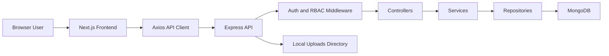

## Frontend Architecture

The frontend uses a feature-oriented App Router structure:

- `frontend/src/app`: route groups, layouts, loading and error boundaries.
- `frontend/src/features`: dashboard, employees, organization, profile, search, settings.
- `frontend/src/services`: API service wrappers around Axios.
- `frontend/src/providers`: auth, React Query, theme, navigation progress.
- `frontend/src/components`: layout, common components, and UI primitives.
- `frontend/src/types`: shared frontend TypeScript contracts.

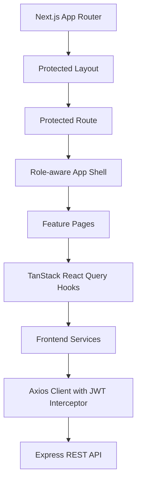

Frontend route coverage:

| Route                    | Component                  | Role Access             |
| ------------------------ | -------------------------- | ----------------------- |
| `/login`                 | Login page                 | public                  |
| `/`                      | Dashboard redirect surface | `SUPER_ADMIN`, `HR`     |
| `/dashboard`             | Dashboard page             | `SUPER_ADMIN`, `HR`     |
| `/employees`             | Employee list              | `SUPER_ADMIN`, `HR`     |
| `/employees/new`         | Create employee            | `SUPER_ADMIN`, `HR`     |
| `/employees/:id`         | Employee details           | `SUPER_ADMIN`, `HR`     |
| `/employees/:id/edit`    | Edit employee              | `SUPER_ADMIN`, `HR`     |
| `/employees/recycle-bin` | Recycle bin                | `SUPER_ADMIN`           |
| `/organization`          | Organization tree          | `SUPER_ADMIN`, `HR`     |
| `/profile`               | Current profile            | all authenticated roles |
| `/settings`              | Account and theme settings | all authenticated roles |

## Backend Architecture

The backend follows route, controller, service, repository, model, validator, and middleware boundaries.

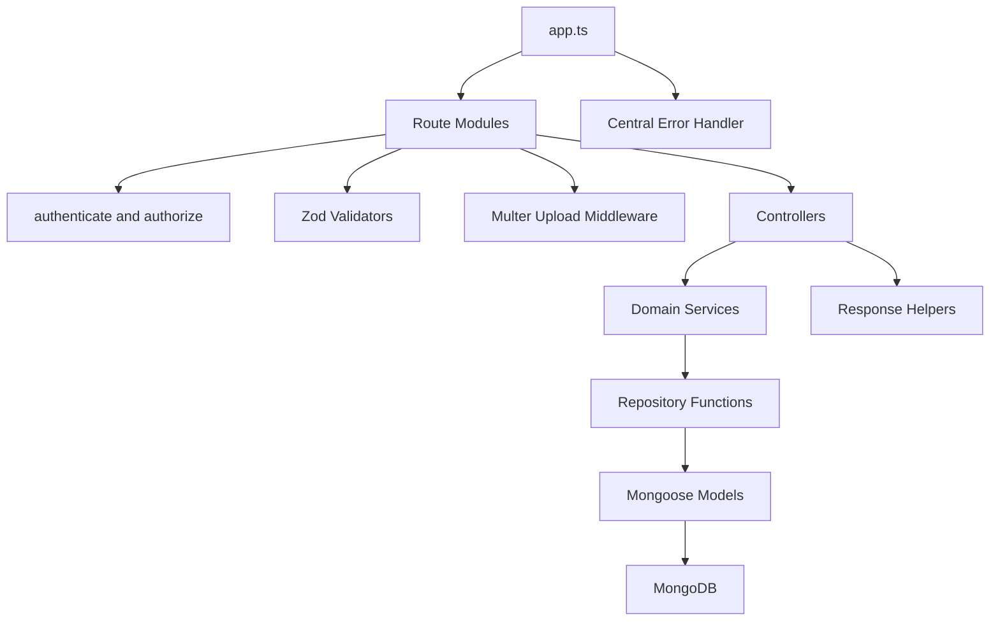

Backend modules:

| Layer        | Responsibility                                                                         |
| ------------ | -------------------------------------------------------------------------------------- |
| Routes       | Express route registration, middleware ordering, and endpoint-level permissions        |
| Controllers  | Request extraction, response status, success message selection                         |
| Services     | Business rules, RBAC refinements, hierarchy logic, import validation, response mapping |
| Repositories | Mongoose query construction, filtering, sorting, pagination, mutations                 |
| Models       | MongoDB collection schemas, indexes, transforms, password hashing hooks                |
| Validators   | Zod request validation for body, query, and params                                     |
| Middlewares  | JWT auth, permission checks, validation bridge, uploads, not found, errors             |

## Database Architecture

MongoDB collections:

- `users`: login identities and roles.
- `employees`: employee profile records, hierarchy links, soft-delete state.
- `counters`: sequential employee ID generation support.

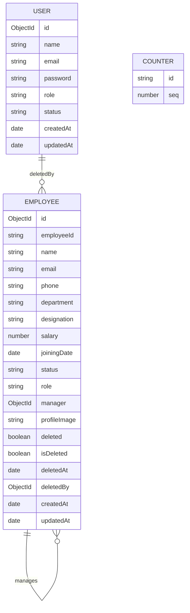

## Authentication Flow

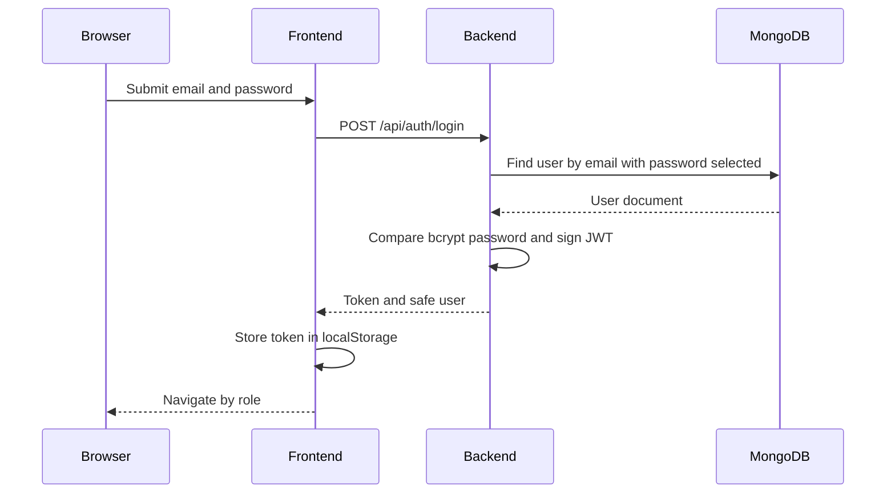

Role-based post-login navigation:

- `EMPLOYEE` goes to `/profile`.
- `SUPER_ADMIN` and `HR` go to `/dashboard`.

## RBAC Flow

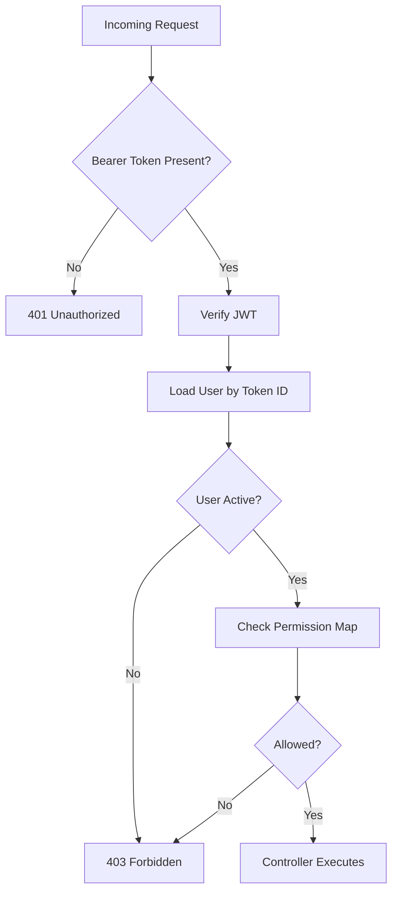

Backend permissions are centralized in `backend/src/constants/permissions.ts`. Frontend visibility is enforced with `RoleGate` and role-filtered navigation, but backend middleware is the final source of authorization.

## Employee CRUD Flow

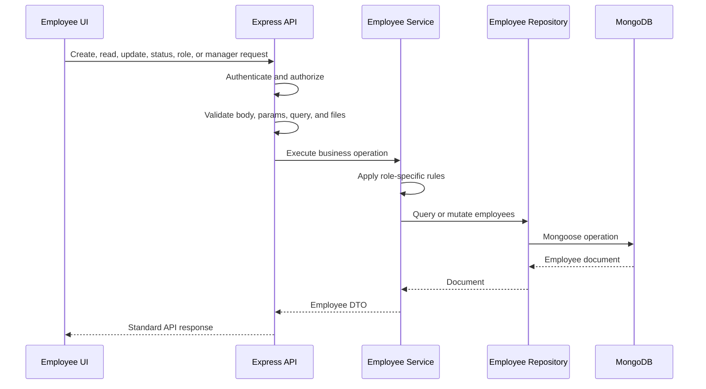

Key CRUD rules:

- `SUPER_ADMIN` can create, update, soft delete, restore, permanently delete, change status, change roles, and assign managers.
- `HR` can create and update employees but cannot modify `SUPER_ADMIN` accounts, change roles, or assign managers through the standard update payload.
- `EMPLOYEE` cannot access the employee list and can only access their own profile and chain.

## CSV Import Flow

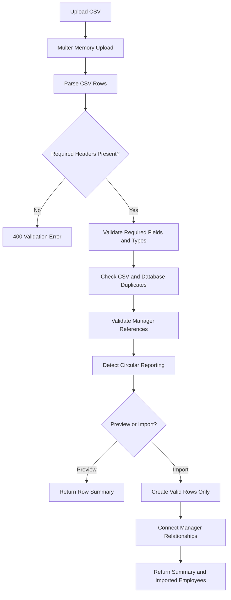

CSV import implementation:

- Template headers are defined in `backend/src/constants/employee-csv.ts`.
- CSV parser and import logic are implemented in `backend/src/services/employee-import.service.ts`.
- Header contract and date parser coverage exists in `backend/tests/employee-csv-contract.test.cjs`.

## Soft Delete Flow

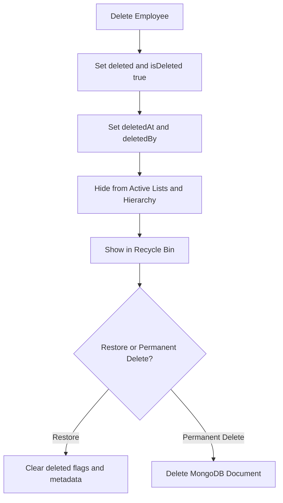

The implementation uses both `deleted` and `isDeleted` flags for compatibility. Active queries exclude records where either flag is true. Deleted queries match either flag.

## Organization Hierarchy Flow

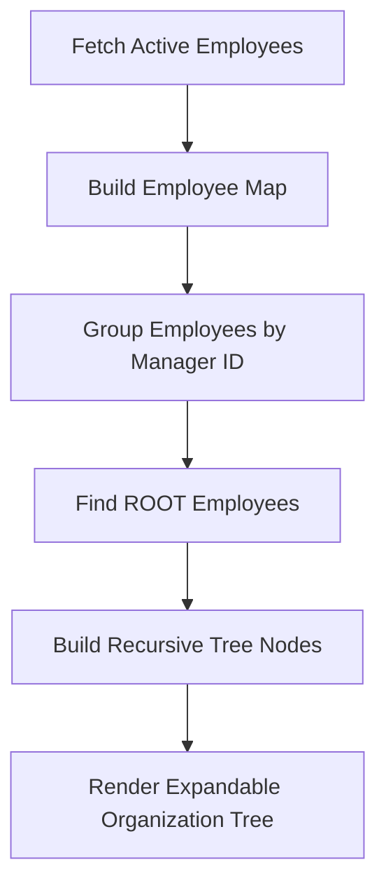

Hierarchy-related backend capabilities:

- Full tree: `GET /api/organization/tree`
- Reportees: `GET /api/employees/:id/reportees`
- Direct reports: `GET /api/employees/:id/direct-reports`
- Chain: `GET /api/employees/:id/chain`
- Manager candidates: `GET /api/employees/:id/manager-candidates`

Manager assignment prevents:

- Self assignment
- Duplicate assignment
- Inactive or deleted managers
- Circular reporting
- Descendant assignment as manager

## Deployment Flow

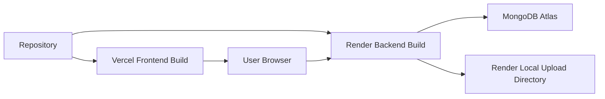

Deployment files:

- `vercel.json`: Next.js frontend build and dev commands.
- `render.yaml`: Render web service, build command, start command, and backend env vars.
- `frontend/.env.example`: `NEXT_PUBLIC_API_URL`.
- `backend/.env.example`: `PORT`, `MONGODB_URI`, `JWT_SECRET`, `NODE_ENV`, `CORS_ORIGIN`.

## Cross-Cutting Concerns

| Concern              | Implementation                                                           |
| -------------------- | ------------------------------------------------------------------------ |
| Security headers     | `helmet()` in `backend/src/app.ts`                                       |
| CORS                 | `cors()` with `CORS_ORIGIN` parsing                                      |
| Compression          | `compression()`                                                          |
| Request logging      | `morgan()`                                                               |
| JSON limit           | `express.json({ limit: "1mb" })`                                         |
| Static uploads       | `/uploads` with immutable cache headers and cross-origin resource policy |
| Error handling       | Central `errorHandler` with production-safe error output                 |
| Client caching       | TanStack React Query with stale time and limited retries                 |
| Client auth recovery | Axios `401` interceptor clears token and redirects to login              |
