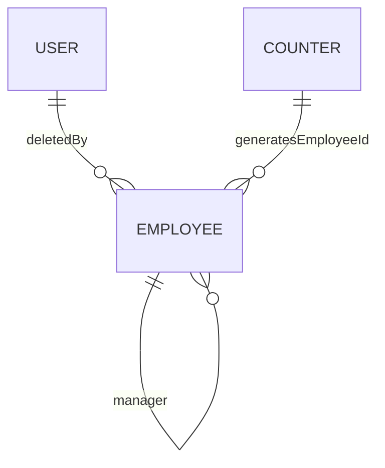
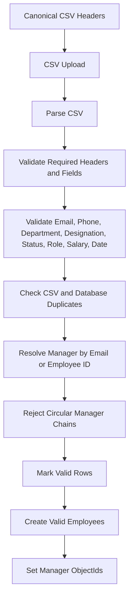

# Database Documentation

The backend uses MongoDB through Mongoose. The database schema is defined in `backend/src/models`.

## Collections

| Collection  | Mongoose Model  | Purpose                                                                                 |
| ----------- | --------------- | --------------------------------------------------------------------------------------- |
| `users`     | `UserModel`     | Authenticated accounts, password hashes, roles, and account status                      |
| `employees` | `EmployeeModel` | Employee profiles, employee IDs, hierarchy links, roles, statuses, soft-delete metadata |
| `counters`  | `CounterModel`  | Sequential counter storage used by employee ID generation                               |

## Relationships



Relationship details:

- `Employee.manager` references another employee document by ObjectId.
- `Employee.deletedBy` references a user document by ObjectId.
- `User.email` and `Employee.email` are separate fields. The application connects an authenticated user to their employee profile by matching email in service logic.
- `Counter._id` stores a counter name such as `employee`, and `Counter.seq` stores the latest numeric sequence.

## User Collection

Model file: `backend/src/models/user.model.ts`

### Fields

| Field       | Type     | Required  | Details                                      |
| ----------- | -------- | --------- | -------------------------------------------- |
| `name`      | `String` | Yes       | trimmed display name                         |
| `email`     | `String` | Yes       | lowercase, trimmed, unique, indexed          |
| `password`  | `String` | Yes       | `select: false`, hashed before save          |
| `role`      | `String` | Yes       | enum: `SUPER_ADMIN`, `HR`, `EMPLOYEE`        |
| `status`    | `String` | Yes       | enum: `ACTIVE`, `INACTIVE`; default `ACTIVE` |
| `createdAt` | `Date`   | generated | Mongoose timestamps                          |
| `updatedAt` | `Date`   | generated | Mongoose timestamps                          |

### Indexes and Unique Fields

| Field   | Constraint      |
| ------- | --------------- |
| `email` | indexed, unique |

### Password Handling

The user schema defines a pre-save hook:

- If `password` was modified, bcrypt hashes it with 12 salt rounds.
- `comparePassword(candidatePassword)` uses bcrypt comparison.
- JSON and object transforms remove `_id`, `__v`, and `password`, and expose `id`.

## Employee Collection

Model file: `backend/src/models/employee.model.ts`

### Fields

| Field          | Type       | Required  | Details                                                  |
| -------------- | ---------- | --------- | -------------------------------------------------------- |
| `employeeId`   | `String`   | Yes       | trimmed, unique, indexed; generated when omitted         |
| `name`         | `String`   | Yes       | trimmed, indexed                                         |
| `email`        | `String`   | Yes       | lowercase, trimmed, unique, indexed                      |
| `phone`        | `String`   | Yes       | trimmed                                                  |
| `department`   | `String`   | Yes       | trimmed, indexed                                         |
| `designation`  | `String`   | Yes       | trimmed                                                  |
| `salary`       | `Number`   | Yes       | minimum `0`                                              |
| `joiningDate`  | `Date`     | Yes       | indexed                                                  |
| `status`       | `String`   | Yes       | enum: `ACTIVE`, `INACTIVE`; default `ACTIVE`; indexed    |
| `role`         | `String`   | Yes       | enum: `SUPER_ADMIN`, `HR`, `EMPLOYEE`; indexed           |
| `manager`      | `ObjectId` | No        | self-reference to `Employee`, default `null`             |
| `profileImage` | `String`   | No        | upload path such as `/uploads/employees/<file>`          |
| `deleted`      | `Boolean`  | Yes       | soft-delete compatibility flag, default `false`, indexed |
| `isDeleted`    | `Boolean`  | Yes       | soft-delete flag, default `false`, indexed               |
| `deletedAt`    | `Date`     | No        | set on soft delete, cleared on restore                   |
| `deletedBy`    | `ObjectId` | No        | references `User`, set on soft delete                    |
| `createdAt`    | `Date`     | generated | Mongoose timestamps                                      |
| `updatedAt`    | `Date`     | generated | Mongoose timestamps                                      |

### Unique Fields

| Field        | Constraint      |
| ------------ | --------------- |
| `employeeId` | unique, indexed |
| `email`      | unique, indexed |

Duplicate key errors for `employeeId` or `email` are normalized to a `409 Conflict` response in employee service operations.

### Indexes

Single-field indexes:

- `employeeId`
- `name`
- `email`
- `department`
- `joiningDate`
- `status`
- `role`
- `deleted`
- `isDeleted`

Compound indexes:

| Index                                                 | Purpose                                        |
| ----------------------------------------------------- | ---------------------------------------------- |
| `{ deleted: 1, department: 1, role: 1, status: 1 }`   | legacy active/deleted filtering                |
| `{ deleted: 1, name: 1 }`                             | legacy name list/search support                |
| `{ deleted: 1, joiningDate: -1 }`                     | legacy date sorting support                    |
| `{ isDeleted: 1, department: 1, role: 1, status: 1 }` | active/recycle-bin filter support              |
| `{ isDeleted: 1, name: 1 }`                           | active/recycle-bin name sorting/search support |
| `{ isDeleted: 1, joiningDate: -1 }`                   | active/recycle-bin joining date sorting        |
| `{ manager: 1, isDeleted: 1, status: 1 }`             | hierarchy and direct report queries            |

### Soft Delete

The repository defines two base filters:

```ts
ACTIVE_EMPLOYEE_FILTER = {
  deleted: { $ne: true },
  isDeleted: { $ne: true },
};

DELETED_EMPLOYEE_FILTER = {
  $or: [{ deleted: true }, { isDeleted: true }],
};
```

Soft delete operation:

- Sets `deleted` to `true`.
- Sets `isDeleted` to `true`.
- Sets `deletedAt` to the current date.
- Sets `deletedBy` to the authenticated user's ObjectId.

Restore operation:

- Sets `deleted` to `false`.
- Sets `isDeleted` to `false`.
- Unsets `deletedAt`.
- Unsets `deletedBy`.

Permanent delete:

- Deletes only records matching `DELETED_EMPLOYEE_FILTER`.

## Counter Collection

Model file: `backend/src/models/counter.model.ts`

### Fields

| Field | Type     | Required | Details                              |
| ----- | -------- | -------- | ------------------------------------ |
| `_id` | `String` | Yes      | counter name, for example `employee` |
| `seq` | `Number` | Yes      | latest sequence value, default `0`   |

The employee ID utility uses this collection to generate sequential employee IDs when an employee is created without an explicit `employeeId`.

## Validation

Backend validation is implemented with Zod.

### Auth Validation

File: `backend/src/validators/auth.validator.ts`

| Field      | Validation                       |
| ---------- | -------------------------------- |
| `email`    | valid email, trimmed, lowercased |
| `password` | non-empty string                 |

### Employee Validation

File: `backend/src/validators/employee.validator.ts`

| Field                | Validation                              |
| -------------------- | --------------------------------------- |
| `name`               | required trimmed string                 |
| `email`              | valid email, trimmed, lowercased        |
| `phone`              | regex `^[0-9+\-\s()]{7,20}$`            |
| `department`         | required trimmed string                 |
| `designation`        | required trimmed string                 |
| `salary`             | coerced number, non-negative            |
| `joiningDate`        | coerced valid date                      |
| `status`             | `ACTIVE` or `INACTIVE`                  |
| `role`               | `SUPER_ADMIN`, `HR`, or `EMPLOYEE`      |
| `manager`            | optional/nullish valid MongoDB ObjectId |
| `removeProfileImage` | optional boolean string on update       |

List query validation:

- `page`: default `1`
- `limit`: default `10`, max `100`
- `search`: optional
- `department`: optional
- `role`: optional role enum
- `status`: optional status enum
- `sortBy`: default `joiningDate`, allowed `joiningDate` or `name`
- `sortOrder`: default `desc`, allowed `asc` or `desc`

Bulk validation:

- `employeeIds` must be a non-empty array of valid MongoDB ObjectIds.

## CSV Data Flow

CSV import does not bypass validation. The import service validates headers and rows before creating any employee records.



CSV fields:

```csv
Employee ID,Name,Email,Phone,Department,Designation,Salary,Joining Date,Status,Role,Manager,Profile Image
```

Supported manager references:

- Existing employee email
- Existing employee ID
- Employee email in the same CSV
- Employee ID in the same CSV

## Manager Relationships

Manager assignment is stored as `Employee.manager`.

Business rules enforced in `backend/src/services/employee.service.ts`:

- Employee cannot be their own manager.
- Manager must exist.
- Manager must be active.
- Manager must not be soft-deleted.
- Duplicate manager assignment is rejected.
- Assigning a descendant as manager is rejected.
- Circular reporting is rejected.
- HR cannot modify `SUPER_ADMIN` accounts.

## Data Access Patterns

| Workflow          | Repository Functions                                  |
| ----------------- | ----------------------------------------------------- |
| Active list       | `findEmployees` with `ACTIVE_EMPLOYEE_FILTER`         |
| Recycle bin       | `findDeletedEmployees` with `DELETED_EMPLOYEE_FILTER` |
| Create            | `createEmployee`                                      |
| Update            | `updateEmployeeById`                                  |
| Soft delete       | `softDeleteEmployeeById`                              |
| Restore           | `restoreEmployeeById`, `restoreEmployeesByIds`        |
| Permanent delete  | `hardDeleteEmployeeById`, `hardDeleteEmployeesByIds`  |
| Status update     | `updateEmployeeStatusById`                            |
| Role update       | `updateEmployeeRoleById`                              |
| Manager update    | `updateEmployeeManagerById`                           |
| Search            | `searchEmployees`                                     |
| Organization tree | `findAllEmployees` and in-memory tree construction    |

## Seed Data

File: `backend/src/seed/users.ts`

Seed behavior:

- Ensures default users for `admin@ems.com`, `hr@ems.com`, and `employee@ems.com`.
- Creates 120 employee profiles when the employee collection is empty.
- Supports `--force` to clear and reseed employees.
- Supports `--append` or `--keep-existing` to add non-conflicting seed data.
- Synchronizes the employee counter after seeding.

Default credentials:

| Role          | Email              | Password      |
| ------------- | ------------------ | ------------- |
| `SUPER_ADMIN` | `admin@ems.com`    | `Password123` |
| `HR`          | `hr@ems.com`       | `Password123` |
| `EMPLOYEE`    | `employee@ems.com` | `Password123` |
