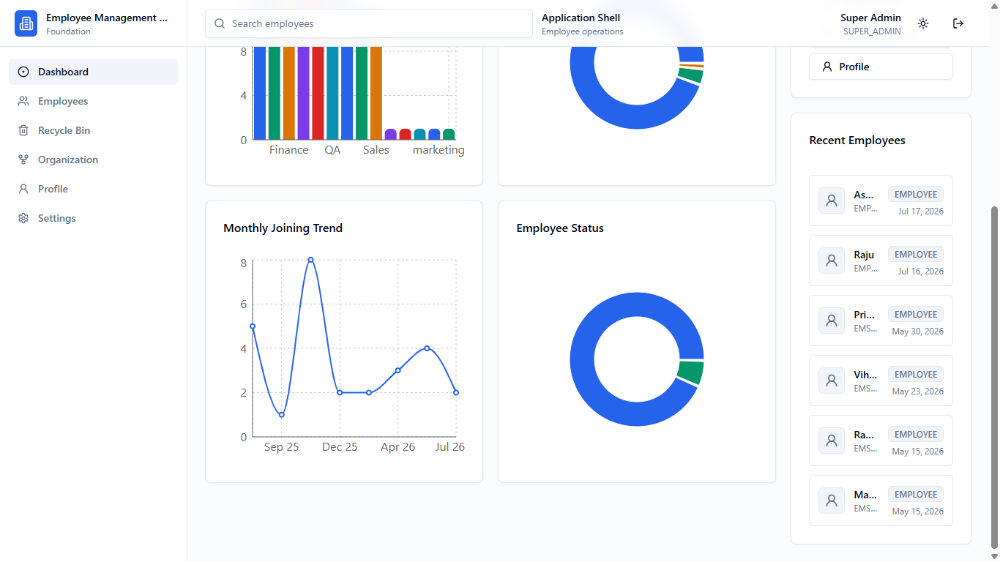
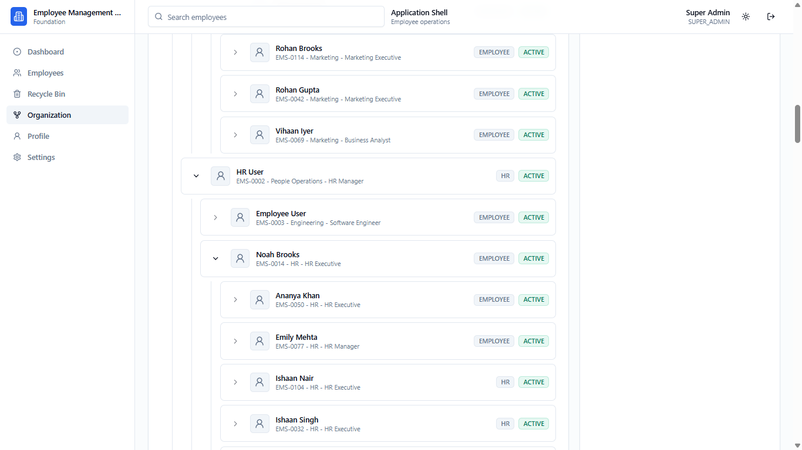

# Screenshots

Screenshots are stored in the root `/screenshots` directory.

## Dashboard

### Dashboard Light

### Dashboard Light Scrolled

### Dashboard Dark

## Employee List

## Recycle Bin

## Organization Tree

### Organization Tree Management View

### Organization Tree HR Section

## Profile

## Settings

## Dark Mode

Dark mode is shown in the dashboard dark screenshot.

## CSV Import

CSV import is implemented in `frontend/src/features/employees/components/employee-import-dialog.tsx`, with backend support in:

- `GET /api/employees/import/template`
- `POST /api/employees/import/preview`
- `POST /api/employees/import`

A CSV import dialog screenshot was not included in the provided attachment set, so this section intentionally does not reference a missing image.

## Responsive Mobile

Responsive layouts are implemented with:

- Mobile sidebar in `frontend/src/components/layout/app-shell.tsx`
- Mobile employee cards in `frontend/src/features/employees/components/employee-table.tsx`
- Mobile recycle-bin cards in `frontend/src/features/employees/components/employee-recycle-bin-page.tsx`
- Responsive dashboard grids and chart containers

A dedicated mobile screenshot was not included in the provided attachment set, so this section intentionally does not reference a missing image.

## Screenshot File Map

| File                                           | Source View                                   |
| ---------------------------------------------- | --------------------------------------------- |
| `screenshots/dashboard-light.png`              | Dashboard top section in light theme          |
| `screenshots/dashboard-light-scrolled.png`     | Dashboard lower chart/recent employee section |
| `screenshots/dashboard-dark.png`               | Dashboard in dark theme                       |
| `screenshots/employees-list.png`               | Employee list with filters and table          |
| `screenshots/recycle-bin.png`                  | Recycle Bin with deleted records              |
| `screenshots/organization-tree-management.png` | Organization hierarchy tree                   |
| `screenshots/organization-tree-hr.png`         | Organization hierarchy scrolled section       |
| `screenshots/profile.png`                      | Authenticated profile page                    |
| `screenshots/settings.png`                     | Settings page                                 |
